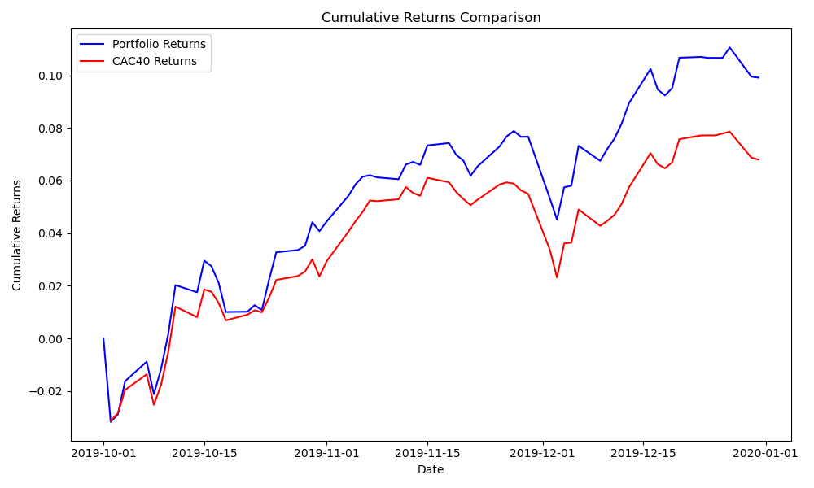
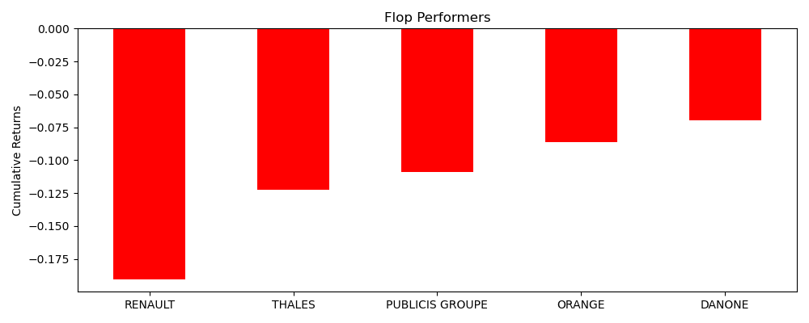

# Overview

The portfolio analysis and reporting tool has been developed for clients to automate the generation of quarterly portfolio analysis dashboards for their entrepreneurial clients. The tool provides information on portfolio performance, asset allocation and risk assessment. It includes a Python implementation with graphical and analytical capabilities.

# Tools I Used

For my portfolio analysis application, I used several powerful tools and technologies to ensure a robust and efficient solution::

- **Python:** The heart of this application, which enables data processing, analysis and reporting. Several key libraries were used:
    - **Pandas Library:** Used for data manipulation and analysis, including working with Excel files and financial datasets. 
    - **Matplotlib Library:** This library were essential for creating clear and insightful data visualisations, such as pie charts and sector distributions.
    - **FPDF:** Automatically generates professional PDF reports summarising a portfolio's performance and outlook.
    - **Tkinter:** Used to create a user-friendly graphical interface, allowing users to enter parameters, upload files and interact with the analysis process.
- **Jupyter Notebooks:** The tool I used to run and execute my Python scripts which let me easily include my notes and analysis.
- **Git & GitHub:** Essential for version control and sharing my Python code and analysis, ensuring collaboration and project tracking.

# Tool development

## Explications

The aim of this project is to automate the creation of a financial report to analyse an investment portfolio. The portfolio contains a maximum of 20 assets, all from the CAC40 index. We selected the relevant data for this analysis, extracted from two main files:

- **CAC40_Index:** Includes Historical data for the CAC40 French stock market index between 1990 and 2020
- **CAC40_closing_94_to_22:** Le fichier regroupe des données sur les cours de clôture et les performances historiques des entreprises du CAC 40 de 1994 à 2022.

In my analysis, I have decided to highlight several elements to better understand and assess the performance of the customer portfolio.

## Points analysed

- **1. Asset allocation:** Calculation of the weight of assets in the portfolio according to the client's risk profile.
- **2. Portfolio statistics:** 
    - Cumulative Return
    - Average Daily Return
    - Volatility (Standard Deviation of Daily Return)
    - Sharpe Ratio
- **3. Specific performance :**
    - Identification of the best and worst assets
    - Comparison of cumulative returns with the CAC40
    - Sector breakdown: Analysis of the business sectors of the companies in the portfolio

View my notebook with detailed steps here : [Reporting](Reporting.ipynb)

## Initializing objects

The script is structured in a class called _PortfolioAnalysis_, initialized as follows:

```python
class PortfolioAnalysis:
    def __init__(self, file_path, initial_investment=100000, name="Nasser BOINA", risk_profile="Prudent", start_date="2019-12-01", end_date="2019-12-31"):
        self.file_path = file_path
        self.initial_investment = initial_investment
        self.name = name
        self.risk_profile = risk_profile
        self.start_date = pd.to_datetime(start_date)
        self.end_date = pd.to_datetime(end_date)
        self.portfolio = self.load_portfolio()
        self.df_filtre = self.process_cac40_data()
        self.weights = self.calculate_weights()
```

Parameters such as _file_path_, _initial_investment_ and _risk_profile_ are used to customise the analysis.
Portfolio and CAC40 data are loaded and filtered according to the specified dates.
Asset weights are calculated according to risk profile (Prudent, Balanced or Dynamic).

## Data analysis

### 1. Loading and processing data

Asset and CAC40 data are loaded using these methods:

```python

def load_portfolio(self):
    "Loads the portfolio from the Excel file."
    ...
    
def process_cac40_data(self):
    "Processes the CAC40 data from the Excel file."
    ...

```
These functions are used to extract and format the data required for analysis.

### 2. Calculation of portfolio weights

```python

def calculate_weights(self):
    "Calculates the weights of the assets in the portfolio."
    ...

```
The assets are weighted according to their initial capital and their prices at the start of the period.A simulation calculates the new asset weights at the end of the period.

## Charts featured

### 1. Breakdown of assets (pie chart)

```python

def plot_pie_chart(self, labels, weights, filename=‘pie_chart.png’):
    "Generates a pie chart for asset weights."
    ...

```
Here is an example of a pie chart

  

*This chart displays the proportions of different assets within the portfolio and it helps to visualise diversification.*

### 2. Comparison of cumulative returns

```python
def plot_comparison(self, port_val, prices_CAC40, filename='comparison.png'):
    "Generates a cumulative yield comparison chart."
    ...

```

Here is an example :

 

*This chart Compare la performance cumulée du portefeuille avec celle de l'indice CAC40.*

### 3. Top and Flop Performers

```python
def plot_top(self, returns, filename='top_performers.png'):
    "Generates a graph of the best performances."
    ...

def plot_flops(self, returns, filename='flop_performers.png'):
    "Generates a graph of the worst performances."
    ...

```



*These charts highlights the 5 best and 5 worst assets over the period.*

### 4. Breakdown by sector

```python
def plot_sector_distribution(self, sector_data, filename=‘sector_distribution.png’):
    ‘‘’Generates a sector distribution graph.‘’"’
    ...
```


*This charts displays the dominant business sectors in the portfolio.*

## How are these graphs generated ?

The application uses Tkinter, a Python library, to create a graphical user interface (GUI) allowing the user to interact with a portfolio analysis tool. Tkinter is used here to design the windows, buttons, input fields and other interface elements.

When the code is executed (see the class _PortfolioApp_), the following interface is displayed. The user must then enter the information required to generate the report.


# Difficulties encountered

A number of challenges were encountered during the development of this project:

**1. Data handling:** 
The processing of financial data, such as the CAC40_closing_94_to_22.xlsb file, required special attention to ensure the accuracy of the calculations. Converting file formats, filtering periods and aligning chronological data required precise manipulation using libraries such as pandas.
Another challenge was to validate the consistency of the dates entered by the user (start and end of reporting), while managing errors due to incorrect entries.

**2. Displaying relevant information:**
Producing clear and informative graphs (sectors, performance comparisons, top/flop companies) meant choosing the right tools and graphical representations. Adjustments had to be made to harmonise the sizes and locations of the graphs in the interface and reporting.
Generating a structured and professional PDF report integrating both graphics and key indicators required careful management of page layouts and margins.

# What I learned

**1. Data management and manipulation:** I strengthened my skills in manipulating large databases using tools such as pandas, in particular to filter, clean and transform financial data.

**2. Development of graphical interfaces:** I learned how to design intuitive user interfaces with tkinter, while ensuring input validation and smooth navigation.
Generating automated PDF reports consolidated my skills in creating professional interactive content.

**3. Data Visualiation:** I gained experience in using visualisation libraries to produce relevant and attractive graphics that summarise complex information in an accessible way.

# Conclusion

This project enabled me to combine a number of technical skills, ranging from data management to financial analysis and the development of interactive interfaces. I learned how to structure an end-to-end process, from user input to the generation of detailed reports. Although obstacles emerged, they were overcome by combining rigour, logic and the right tools.

In conclusion, this project gave me an enriching and concrete experience in the field of portfolio analysis, preparing me for similar challenges in professional contexts. It's a solid basis for tackling more complex projects related to finance or interactive visualisations.
